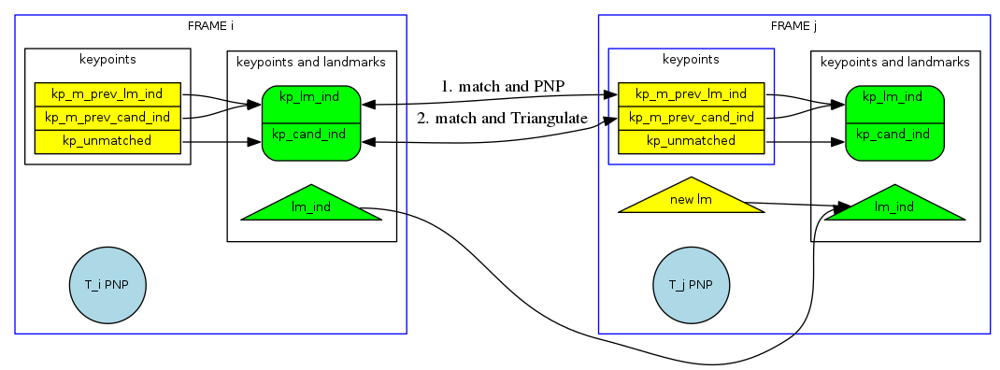

# simple_vslam

simple_vslam is a python based implementation of visual slam using opencv.
## Prerequisites
The following python packages are required to run this code:
  - opencv
  - matplotlib
  - numpy
  - scipy
  - yaml
  - colorama

The code has been tested with the following conda environment:
```sh
conda create -n simple_vslam_env python=3.5 opencv=3.3.1 matplotlib numpy scipy pyyaml colorama
conda activate simple_vslam_env
```
## Installation
```sh
git clone --recurse-submodules https://gitlab.com/neu-mit-lfi/simple_vslam.git
cd simple_vslam
git checkout zernike_gtsam
```

## Get test data
You can download a subset of the Kitti dataset to test this package from http://rpg.ifi.uzh.ch/docs/teaching/2016/kitti00.zip  Unzip and save it to a convenient location like `~/data`

## Executing the package
Edit a config file to point it to an image folder eg.
```sh
gedit config/kitti.conf
```
Depending on the system, make sure either osx_image_folder or linux_image_folder points to the appropriate image folder. Then run the code with:
```sh
./vslam.py -c config/kitti.conf
```

## Algorithm
### Frame Dataflow


### iSAM2 algorithm
1. Process X<sub>0</sub>  
   
    1. Add prior factor for X<sub>0</sub>
    2. Add estimate for X<sub>0</sub>
1. Process X<sub>1</sub>  
   
    1. Add range factor between X<sub>0</sub> - X<sub>1</sub>  
    3. Add estimate for X<sub>1</sub>
1. Process X<sub>2</sub>  
   
    1. Add projection factor between X<sub>2</sub> - l<sub>2</sub>, X<sub>1</sub> - l<sub>2</sub> & X<sub>0</sub> - l<sub>2</sub>
    2. Add estimate for X<sub>2</sub> & l<sub>2</sub>

1. Process X<sub>3</sub>  
   
    1. Add projection factor between X<sub>3</sub> - l<sub>4</sub>, X<sub>2</sub> - l<sub>4</sub> & X<sub>1</sub> - l<sub>4</sub>
    2. Add estimate for X<sub>3</sub> & l<sub>4</sub>

