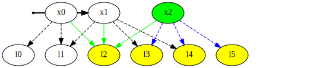

# simple_vslam [](https://travis-ci.com/neufieldrobotics/simple_vslam)

simple_vslam is a python based implementation of visual slam using opencv.
## Prerequisites
The following python packages are required to run this code:
  - opencv
  - matplotlib
  - numpy
  - scipy
  - yaml
  - colorama

## Installation
The code has been tested with the following conda environment specified in [conda_env.yml](./conda_env.yml):

### Clone the repo and submodules
It is important to follow these commands to make sure all the external submodules are cloned.
```sh
git clone --recurse-submodules https://github.com/neufieldrobotics/simple_vslam.git
cd simple_vslam

# OPTIONALLY To checkout a particular 'tag' eg. v0.2.2 run:
git checkout v0.2.2
```
#### Some important versions:
  - v0.1.0: Basic GTSAM incormporated
  - v0.2.0: Cleaned up and configured to use with Iceberg datasets, use -c config_file flag for appropriate config file. 
  - v0.2.1: Major bug fixed, use GTSAM corrected poses on current as well as previous pose to make new point triangulation accurate, this version works with the full Stingray dataset
  - v0.2.2: Small config tweak in findEssential threshold to make Stingray work on 18.04

### Create Conda Environment
These are instructions for installing gtsam in a conda environment so that the rest of the system is untouched.  This would let you use gtsam without interfering with the ROS installation.
```sh
# Create an environment called simple_vslam_env as specified in conda_env.yml
# We like python 3.5.6 since it works with OpenCV 3.3.1 which comes with SIFT out of the box
# instead of having to compile it.
conda env create --file conda_env_py36.yml
# activate the environment
conda activate simple_vslam_env
```

### GTSAM Installation
Main repo https://github.com/borglab/gtsam

When we build the GTSAM python wrapper, it builds it for the specified version of Python. Thus, we need to have the correct conda environment activated while building it.  Also, this is why it is probably better to install gtsam locally instead of system-wide using `sudo make install`

Note: The GTSAM Overview lists Intel Math Kernel Library as optional, but **DO NOT INSTALL IT**. If Intel Math Kernel Library is installed, GTSAM compilation expects to use it. However, the standard Python doesn't use Math Kernel Library and will cause issues. So if you want to use the Intel Math Kernel Library, make sure it works with your python installation.

```sh
# On termial go into the conda environment by running
conda activate simple_vslam_env

# Check which Python the system is using by running:
which python
# The output should be the one from the conda environment on mac /Users/<username>/anaconda3/envs/simple_vslam_env/bin/python

# Also check the current PYTHONPATH by running:
echo $PYTHONPATH
# On my mac it was empty

# Install pre-reqs, you might have most of these already
# for linux
# sudo apt install python-pip cmake libboost-all-dev

# The original gtsam code can be cloned with git clone https://github.com/borglab/gtsam.git ~/apps/gtsam
# However, the system was last tested with commit ff60ea8dbc70ebabbc6b4e34d1d52057ef4d9c33
git clone https://github.com/borglab/gtsam.git

cd gtsam
# Check out the known commit that works with this repo
# Checked with release candidate 4.1.0 on 05/26/2021
git checkout release/4.1.0

# Install gtsam python requirements with, these should already be in your environment
pip install -r python/requirements.txt 

# Edit the CMakeLists.txt file to the flags GTSAM_BUILD_PYTHON, GTSAM_INSTALL_MATLAB_TOOLBOX and GTSAM_INSTALL_CYTHON_TOOLBOX turn off GTSAM_ALLOW_DEPRECATED_SINCE_V4, 
# the respective lines should look as follows:
  
option(GTSAM_BUILD_PYTHON                "Enable/Disable building & installation of Python module with pybind11" ON)
option(GTSAM_ALLOW_DEPRECATED_SINCE_V41  "Allow use of methods/functions deprecated in GTSAM 4.1" OFF)


# These instructions are for installing within a conda environment, for system wide installation, this would have to be adjusted accordingly:  
mkdir build
cd build
cmake -D GTSAM_PYTHON_VERSION=3.6 -DCMAKE_INSTALL_PREFIX=/home/<username>/gtsam_bin ..
make check -j4 # (check optional, runs unit tests)
# Takes about 30 mins.
make -j4
make python-install # this should install the binaries to /home/<username>/gtsam_bin

# test installation with (from gtsam directory):
python ./python/gtsam/examples/ImuFactorISAM2Example.py 

# If using conda environments, add the path '/home/<username>/gtsam_bin/cython' to a .pth file in 
# '/home/<username>/anaconda/envs/simple_vslam_env/lib/python3.5/site-packages/gtsam.pth'
```

## Get test data
Test datasets, Unzip and save it to a convenient location like `~/data`. The most extensively tested dataset is Stingray which uses the config file, [config/go_pro_Stingray2_800x600.yaml](./config/go_pro_Stingray2_800x600.yaml)
  - Stingray dataset: [https://coe.northeastern.edu/fieldrobotics/2018_iceberg_gopro_datasets/Stingray2/](https://coe.northeastern.edu/fieldrobotics/2018_iceberg_gopro_datasets/Stingray2/) 
  - Lars dataset: [https://coe.northeastern.edu/fieldrobotics/2018_iceberg_gopro_datasets/Lars2/](https://coe.northeastern.edu/fieldrobotics/2018_iceberg_gopro_datasets/Lars2/) 
  - Cervino dataset: [https://coe.northeastern.edu/fieldrobotics/2018_iceberg_gopro_datasets/Cervino1/](https://coe.northeastern.edu/fieldrobotics/2018_iceberg_gopro_datasets/Cervino1/) 
  - KITTI: [http://rpg.ifi.uzh.ch/docs/teaching/2016/kitti00.zip](http://rpg.ifi.uzh.ch/docs/teaching/2016/kitti00.zip) 
  
## Executing the package
Edit a config file to point it to an image folder eg.
```sh
gedit config/kitti.conf
```
Depending on the system, make sure either osx_image_folder or linux_image_folder points to the appropriate image folder. You can also choose the feature detector and descriptor to be used (independently). Then run the code with:
```sh
./vslam.py -c config/kitti.conf
```

## Algorithm
### Frame Dataflow


### iSAM2 algorithm
1. Process X<sub>0</sub>  
   
    1. Add prior factor for X<sub>0</sub>
    2. Add estimate for X<sub>0</sub>

1. Process X<sub>1</sub>  
   
    1. Add range factor between X<sub>0</sub> - X<sub>1</sub>  
    3. Add estimate for X<sub>1</sub>

1. Process X<sub>2</sub>  
   
    1. Add projection factor between X<sub>2</sub> - l<sub>2</sub>, X<sub>1</sub> - l<sub>2</sub> & X<sub>0</sub> - l<sub>2</sub>
    2. Add estimate for X<sub>2</sub> & l<sub>2</sub>

1. Process X<sub>3</sub>  
    
    1. Add projection factor between X<sub>3</sub> - l<sub>4</sub>, X<sub>2</sub> - l<sub>4</sub> & X<sub>1</sub> - l<sub>4</sub>
    2. Add estimate for X<sub>3</sub> & l<sub>4</sub>
